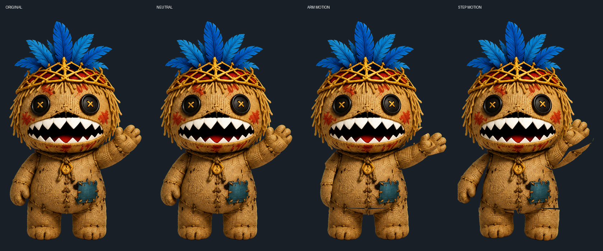

# Coco 桌宠

[](https://github.com/ForceMind/PetDesktop/actions/workflows/build.yml)
[](https://github.com/ForceMind/PetDesktop/releases/latest)

Coco 是一个面向 Windows 和 macOS 的透明桌面宠物。当前角色严格以
[`assets/coco.png`](assets/coco.png) 为唯一母版：头和身体保持完整，手臂与脚部从同一张原图中提取，
不再使用重新绘制的纸片人角色。



## 下载

推荐直接从 [Releases](https://github.com/ForceMind/PetDesktop/releases/latest) 下载：

- Windows：下载 EXE 文件，双击即可运行，无需安装。
- macOS：下载 macOS ZIP，解压后运行 `Coco桌宠.app`。

当前稳定版本为 `v1.2.0`。macOS 包使用本地临时签名；首次启动若被 Gatekeeper 阻止，
请在 Finder 中右键应用并选择“打开”。

## 主要功能

- 透明、无边框、默认始终置顶的桌宠窗口。
- 左键拖动；滚轮连续缩放；透明区域在 Windows 上支持点击穿透。
- 持续呼吸、轻摆、踏步和挥手等动态待机，不会静止成单张图片。
- 根据鼠标的全局位置平滑转向，左右方向经过自动测试。
- 点击头部、左右脸、左右手、身体和脚部会进入不同动作组。
- 32 种连续动作均由身体轨迹和原图关节层实时插值，并在结束后回到待机状态。
- 对话气泡根据中英文内容自动换行和调整尺寸，位于角色旁边且不遮挡角色。
- 中文模式允许偶尔混入简单英文；英文模式只显示英文。
- 默认、红围巾、蓝披风、圆眼镜、海军帽五种造型。
- Windows 单文件 EXE 与 macOS 通用 App 都带有 Coco 原图头像图标。

## 操作

| 操作 | 效果 |
| --- | --- |
| 按住鼠标左键拖动 | 移动 Coco |
| 单击角色 | 按点击部位随机触发动作与对白 |
| 鼠标滚轮 | 连续调整角色大小 |
| 鼠标右键 | 打开大小、语言、换装、置顶和退出菜单 |
| 移动鼠标 | Coco 平滑朝鼠标方向转动 |

点击区域与主要动作组：

| 区域 | 动作示例 |
| --- | --- |
| 头部 | 点头、神气、惊喜、漂浮、困倦 |
| 左脸 / 右脸 | 左右探头、摇摆、旋转、眩晕、大笑 |
| 左手 / 右手 | 左右跳、鞠躬、跳舞、蓄力、八字移动 |
| 身体 | 压扁回弹、心跳、颤动、潜行、拉伸 |
| 脚部 | 跳跃、弹跳、跺脚、踮脚、前后空翻 |

完整的 32 种动作包括：跳跃、压扁回弹、左右抖动、连续弹跳、点头、摇摆、原地转身、
反向旋转、向左跃、向右跃、踮脚、拉伸、缩小、左探头、右探头、八字移动、快速颤动、
神气挺胸、鞠躬、惊喜探头、后空翻、前空翻、跳舞、太空步、心跳、眩晕、潜行、蓄力冲锋、
漂浮、跺脚、大笑和困倦摇摆。

## 本地构建

Windows PowerShell：

```powershell
.\build.ps1 -Clean
.\smoke_test.ps1
```

输出文件为 `dist\Coco桌宠.exe`。Windows 构建使用系统 .NET Framework C# 编译器，
不要求安装 Visual Studio 或 .NET SDK。

macOS 11 或更高版本，并已安装 Xcode：

```bash
chmod +x build_macos.command
./build_macos.command
```

输出文件为 `dist-macos/Coco桌宠.app` 和 `dist-macos/Coco桌宠-macOS.zip`。
脚本会尽可能同时构建 Apple Silicon 与 Intel 架构，并生成通用二进制。

## 文档

- [架构与动画设计](docs/ARCHITECTURE.md)
- [素材与原图约束](docs/ASSETS.md)
- [构建与 GitHub 发布](docs/BUILD_AND_RELEASE.md)
- [测试与验收](docs/TESTING.md)
- [故障排查](docs/TROUBLESHOOTING.md)
- [版本变更记录](CHANGELOG.md)

## 项目状态

- 当前发布：[`v1.2.0`](https://github.com/ForceMind/PetDesktop/releases/tag/v1.2.0)
- Windows 与 macOS 由 GitHub Actions 自动构建。
- `assets/poses`、`assets/idle` 和 `assets/sprite_sheets` 是早期美术研究资料，
  不参与当前实时角色渲染。

## 许可证

本项目使用 [Apache License 2.0](LICENSE)。角色图片与第三方素材的使用还应遵守其各自权利要求。
