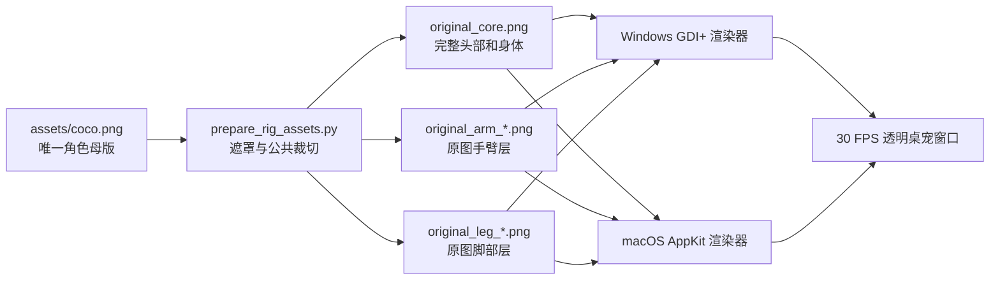

# 架构与动画设计

## 目标

当前实现优先保证三个不变量：角色必须来自原图、动画过程中比例不变、任意动作最终回到待机。
动作幅度会受到关节覆盖范围限制，避免为了夸张动作再次出现四肢脱节或透明裂缝。

## 资源与运行时流程

所有角色层共享 `745 × 1205` 的逻辑画布。渲染器只对整个画布做统一尺寸缩放，
不会分别拉伸头、身体或四肢。

## 图层顺序

从后到前的主要顺序如下：

1. 蓝披风等需要位于身体后方的附件。
2. 左右脚部。
3. 左右手臂。
4. `original_core.png`，包含完整头部、面部和身体，并覆盖关节连接区。
5. 围巾、眼镜、帽子等前景附件。

原图四肢层仍保留少量位于身体内部的像素。旋转时这些像素被核心层盖住，
因此关节不会显示成两个互不相连的独立图片。

## 动画模型

32 种交互各自包含两部分：

- `CalculateAnimation` / `motionForAction`：控制整只 Coco 的位置和旋转轨迹。
- `CalculateRigPose` / `rigPoseForAction`：控制左右手臂、左右脚部和轻微转向参数。

动作进度被归一化为 `0...1`。正弦包络保证动作在开始与结束时回到零位，
关节限制器再把角度和位移约束在原图遮罩能够安全覆盖的范围内。

运行时虽然保留了旧动作曲线中的缩放参数以兼容计算和测试，但最终绘制前会把
横纵缩放锁定为 `1`，因此不会把原图压扁或拉长。

## 动态待机与鼠标跟随

- 待机包含持续的上下呼吸、轻微摇摆，以及随机出现的挥手、踏步和伸展动作。
- 鼠标位置使用全局屏幕坐标计算，再经过指数平滑，避免方向变化时瞬间跳动。
- 交互动作的中段会降低鼠标跟随权重，动作结束阶段再平滑恢复。
- 原图的眼睛是纽扣，不能独立移动；当前通过整个头身核心的极小角度转向表达注视，
  以避免再次切开头部产生接缝。

## 点击区域

角色显示矩形被归一化为 `0...1` 坐标，并划分为头、左右脸、左右手、身体和脚部。
每个区域拥有独立动作候选集合；同一部位可以随机触发多种效果。

## 平台实现

### Windows

- `DesktopPetForm.cs`：窗口、菜单、动作、对白、气泡与 GDI+ 合成。
- `NativeMethods.cs`：`UpdateLayeredWindow`、透明点击穿透等 Win32 调用。
- 每帧在带预乘 Alpha 的位图中合成，再一次性更新分层窗口。
- 仅当窗口位置或尺寸确实改变时调用 `SetBounds`，降低窗口闪动概率。

### macOS

- `macos/main.swift`：原生 AppKit 窗口、菜单、事件与 Core Graphics 合成。
- 应用使用 `LSUIElement`，不会显示常规 Dock 图标和菜单栏入口。
- 构建脚本尝试生成 `arm64` 与 `x86_64`，成功时使用 `lipo` 合并为通用程序。

## 对白与气泡

- 中文模式：中文为主，可随机出现简单英文词句。
- 英文模式：只从纯英文动作句和通用句中选择。
- 混合模式：随机选择中文或英文。
- 气泡先测量文本，再计算宽高和换行；气泡位于角色旁边，并根据屏幕位置选择左右方向。
