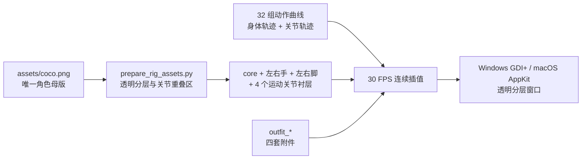

# 架构与动画设计

## 核心不变量

1. 所有运行时画面都来自同一张 Coco 原图的核心、左右手和左右脚分层，不切换独立生成的角色图。
2. 位置、旋转和关节角度按 30 FPS 连续计算；动作在进度 `0` 和 `1` 都严格回到中立姿势。
3. 角色始终保持原图 `745:1205` 比例；整体变换只使用横纵一致的等比缩放。
4. 换装在角色绘制栈内部合成：披风位于身体后方，围巾、眼镜和帽子位于身体前方。

## 资源与运行时流程

旧的 `frame_animation`、`poses`、`idle` 和 `sprite_sheets` 目录作为实验记录保留，但构建脚本不会把它们
复制或嵌入发布包。

## 时间线与状态机

- `Idle`：持续呼吸、轻摆、手脚微动和鼠标注视，并间歇触发幅度较大的待机手势。
- `Action`：根据点击区域选择动作，同时计算整体位移/旋转与手脚/头部关节曲线。
- 每条动作曲线使用归一化进度 `t ∈ [0,1]`；包络 `sin(πt)` 保证关节在首尾归零。
- 动作结束后立即重置待机计时器，因此最后一个动作画面和第一个待机画面使用同一套中立骨骼。
- 旋转、空翻等动作可绕中心运动，普通动作绕脚底运动；二者都使用同一组原图分层。

## 点击与对白

角色矩形被归一化为头、左右脸、左右手、身体和脚部七个区域，每个区域有独立动作候选集合。
对白气泡先测量文字，再调整宽高和窗口范围，始终位于角色旁边。中文模式允许少量简单英文，
英文模式只从纯英文语料池取句子。

## 平台实现

### Windows

- `DesktopPetForm.cs` 负责状态机、关节曲线、GDI+ 离屏合成、菜单和对白。
- `NativeMethods.cs` 提供分层窗口、透明背景与透明区域点击穿透。
- `build.ps1` 将五个原图骨骼层、四个运动关节衬层、四个换装附件和图标嵌入单文件 EXE。

### macOS

- `macos/main.swift` 使用同一组骨骼、换装顺序、等比约束和动作曲线。
- `build_macos.command` 只复制原图、骨骼和换装资源，并构建 `arm64`/`x86_64` 通用程序。

## 换装绑定

附件坐标使用 `745 × 1205` 的骨骼坐标系，而不是窗口坐标。整体跳跃、旋转、缩放和鼠标注视变换
在附件绘制前已经进入同一个图形上下文，所以附件始终贴在角色身上，不会停留在原位置或漂浮。

## 关节衬层

单张原图的透明轮廓外没有可供旋转的像素。手脚大幅旋转时，运行时会在身体后方绘制窄胶囊形麻布
衬层，并以关节一半角度运动。衬层透明度随角度增大、在中立姿势归零，因此既能填住肩部/髋部的
白色月牙缝，又不会在待机时改变 Coco 的原始轮廓。
