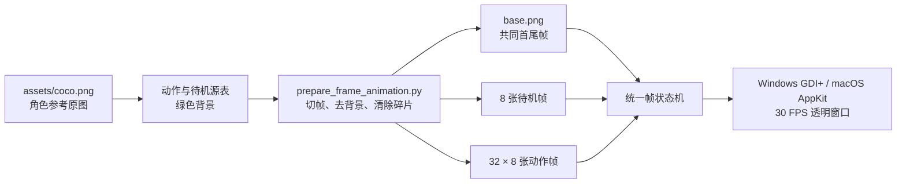

# 架构与动画设计

## 核心不变量

当前实现以逐帧动画为唯一角色本体渲染路径，并保证：

1. 待机和每个交互动作都有独立角色画面，不用一张图片的位移或拉伸代替动作。
2. 所有资源使用 `512 × 512` 透明画布并等比显示。
3. 所有动作的第一帧和最后一帧都引用同一个 `base.png`，它也是待机的第一帧。
4. 动作帧不做交叉透明叠加，避免相距较远的手脚形成重影。

## 资源与运行时流程



`manifest.json` 是素材契约：记录画布、帧率、待机资源、32 个动作名称与帧顺序。

## 时间线

待机循环：

```text
base → idle_01 → … → idle_08 → base
```

每个动作：

```text
base → action_NN_01 → … → action_NN_08 → base
```

动作结束时重置待机计时器，因此下一个渲染节点仍是同一个 `base` 对象。待机姿势变化较小，
相邻帧可使用平滑过渡；交互动作只显示实际画面，不把两个大幅姿势透明叠在一起。

## 状态机

- `Idle`：循环播放动态待机，同时根据全局鼠标位置做轻微方向响应。
- `Action`：根据点击区域选择动作并播放该动作的 8 张独立帧。
- 动作进度达到 1 后切回 `Idle`，并从共同基准帧重新开始。
- 新点击会开始新的完整动作时间线；拖动、滚轮和菜单不会改变帧画布比例。

## 点击与对白

角色矩形被归一化为头、左右脸、左右手、身体和脚部七个区域。每个区域有独立动作候选集合。
对白气泡先测量文本再计算窗口尺寸，始终位于角色旁边；中文、英文和混合模式使用不同语料池。

## 平台实现

### Windows

- `DesktopPetForm.cs` 负责状态机、资源加载、菜单、对白与 GDI+ 合成。
- `NativeMethods.cs` 提供分层窗口和透明点击穿透。
- 136 个旧关节/姿势资源不再进入构建；EXE 嵌入基准帧、8 张待机帧、256 张动作帧与附件。

### macOS

- `macos/main.swift` 使用相同帧命名、顺序、时长和共同首尾帧规则。
- `build_macos.command` 将帧资源复制进 App Bundle，并构建 `arm64`/`x86_64` 通用程序。

## 换装

围巾、披风、眼镜和帽子仍是独立透明附件。披风在角色后绘制，其余附件在角色前绘制；
它们不会修改逐帧角色资源。
